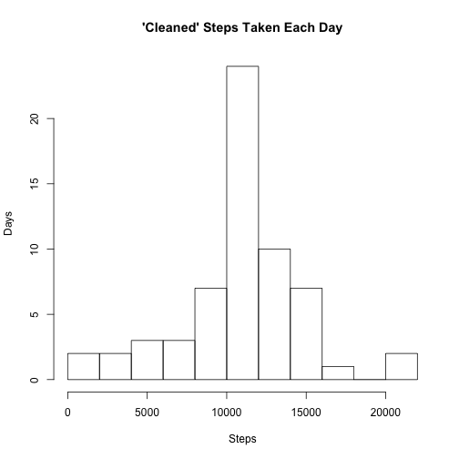

# Reproducible Research: Peer Assessment 1
## Loading and preprocessing the data

```r
data<-read.csv('activity.csv')
day.sum<-tapply(data$steps, INDEX=data$date,FUN=sum, na.rm=TRUE)
```

## What is mean total number of steps taken per day?

```r
hist(day.sum, breaks=10, main="Steps Taken Each Day", xlab="Steps", ylab="Days")
```

 

```r
day.mean<-mean(day.sum)
day.median<-median(day.sum)

## function for formatting numbers with commas as thousands separator
num_format <- function(x){
    format(x, big.mark=",")
}
```
The total number of steps taken per day has mean: 9,354 and median: 10,395.

## What is the average daily activity pattern?

```r
data$interval<-factor(data$interval, exclude=NULL)
interval.mean<-tapply(data$steps, INDEX=data$interval, FUN=mean, na.rm=TRUE)

plot(rownames(interval.mean), interval.mean,type="l", main="Mean Steps Taken Each 5min Interval", xlab="Interval", ylab="Mean Steps")
```

 

```r
max.interval<-names(which.max(interval.mean))[1]
```
The 5-minute interval, on average across all the days in the dataset, with the maximum number of steps is: 835. 

## Imputing missing values

```r
incomplete.nrows<-nrow(data)-sum(complete.cases(data))
```
The total number of rows missing a value in the dataset is: 2,304.


```r
## clean the data, replacing NA's in 'steps' with the mean steps for that interval 
data.clean<-data
data.clean[,"interval.mean.steps"]<-interval.mean[match(data$interval, rownames(interval.mean))]
data.clean$steps[is.na(data.clean$steps)]<-data.clean$interval.mean.steps[is.na(data.clean$steps)]
data.clean<-data.clean[,1:3]

day.sum.clean<-tapply(data.clean$steps, INDEX=data.clean$date,FUN=sum, na.rm=TRUE)
hist(day.sum.clean, breaks=10, main="'Cleaned' Steps Taken Each Day", xlab="Steps", ylab="Days")
```

 

```r
day.mean.clean<-mean(day.sum.clean)
day.median.clean<-median(day.sum.clean)
```
The 'Cleaned' data total number of steps taken per day has mean: 10,766 and median: 10,766. The mean and median have both increased vs the uncleaned data, and are actually equal in the cleaned data. This is because a large number of days had all NA step data and thus they were populated with average interval data... nice hey. Table comparing them is below;

```r
## summary data raw v clean
res.compare<-data.frame(c(day.mean, day.median),c(day.mean.clean, day.median.clean))
names(res.compare)<-c("raw","clean")
rownames(res.compare)<-c("mean","median")
res.compare[,"raw-clean"]=res.compare[,"raw"]-res.compare[,"clean"]
num_format(res.compare)
```

```
##           raw  clean raw-clean
## mean    9,354 10,766  -1,412.0
## median 10,395 10,766    -371.2
```

## Are there differences in activity patterns between weekdays and weekends?

```r
## create new factor weekend / weekday
data.clean$wday<-as.POSIXlt(data$date)$wday
data.clean$wend<-ifelse(data.clean$wday > 0 & data.clean$wday < 6,"weekday","weekend")
data.clean$wend<-as.factor(data.clean$wend)
data.wend<-with(data.clean, tapply(steps, INDEX=list(interval, wend),FUN=mean))

## plot using base plot with unmelted data
par(mfrow=c(2,1))
plot(rownames(data.wend),data.wend[,"weekend"], type="l",main="Weekend",xlab="Interval",ylab="Number of Steps")
plot(rownames(data.wend),data.wend[,"weekday"], type="l",main="Weekday",xlab="Interval",ylab="Number of Steps")
```

 

```r
par(mfrow=c(1,1))

## just for fun to compare plot packages:)
## plot using xyplot with melted data
library(reshape2)
data.wend.melt<-melt(data.wend, value.name="steps")
names(data.wend.melt)[1:2]<-c("interval","wend")
library(lattice)
xyplot(steps ~ interval | wend, data=data.wend.melt, layout=c(1,2), type="l",xlab="Interval",ylab="Number of Steps")
```

 
